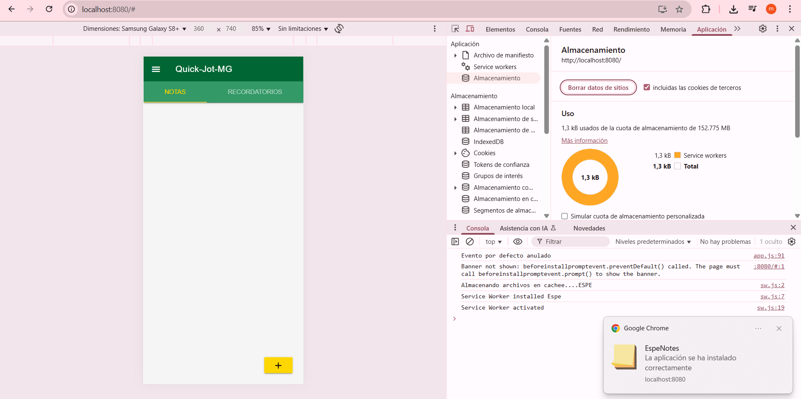
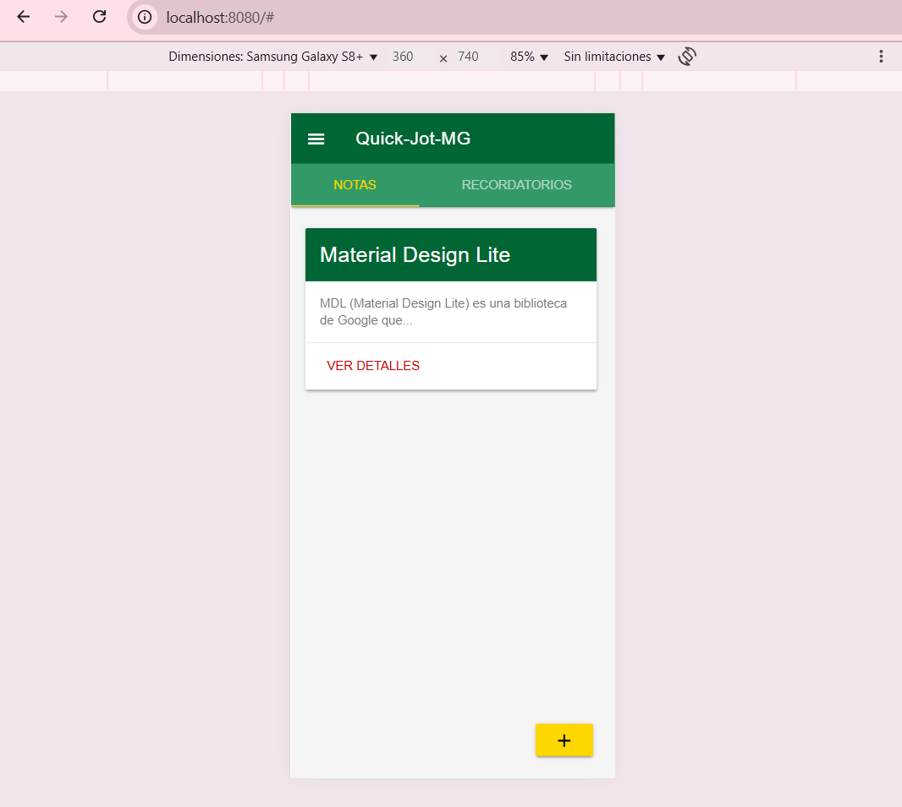
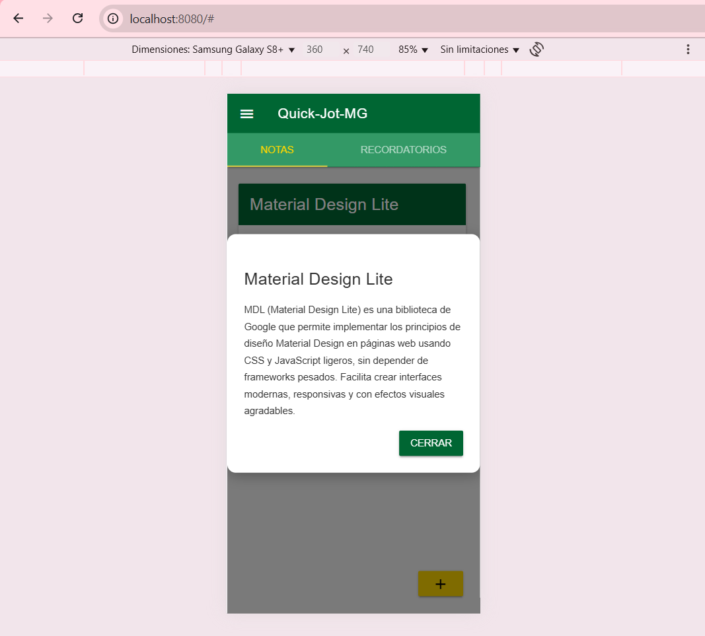
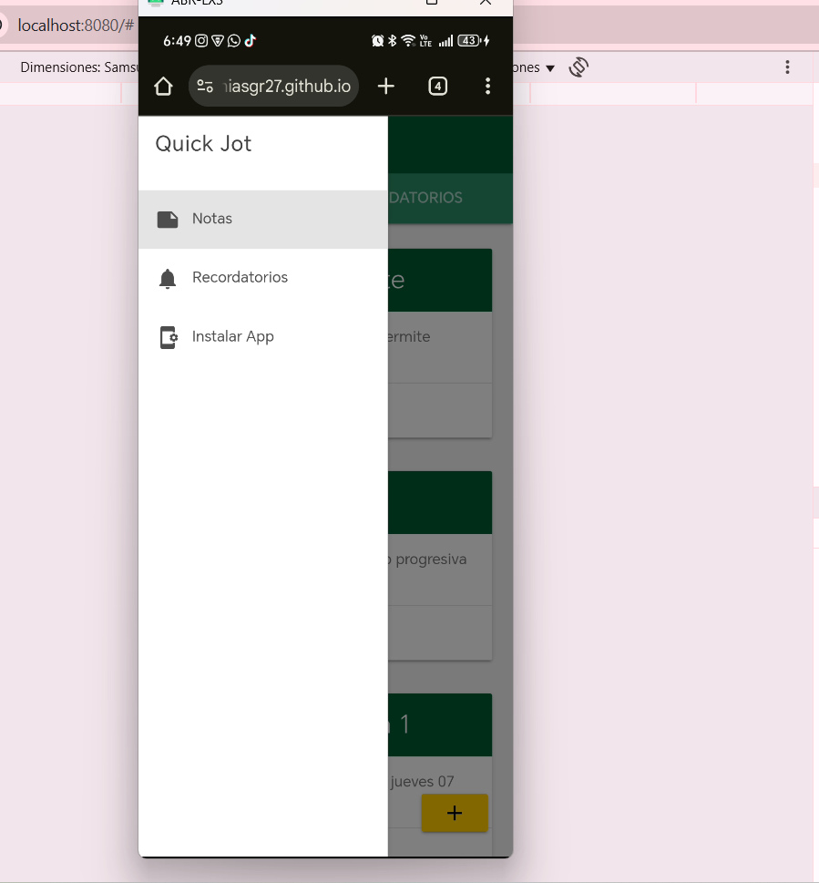
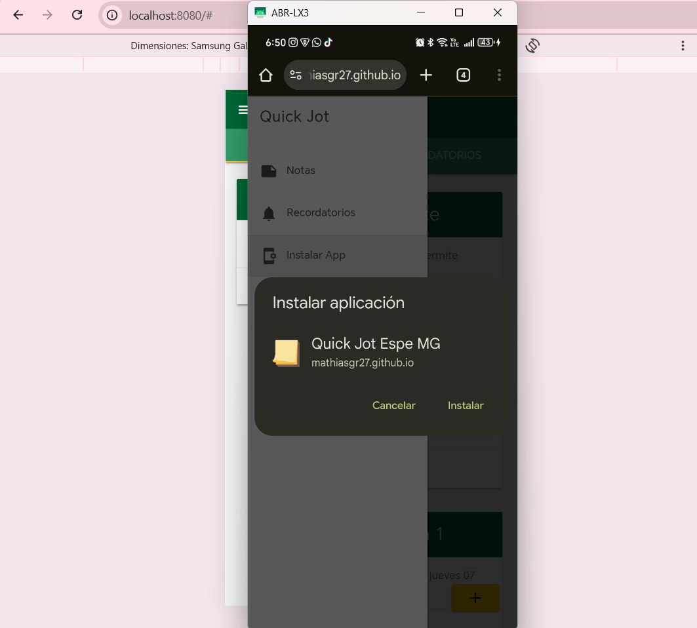
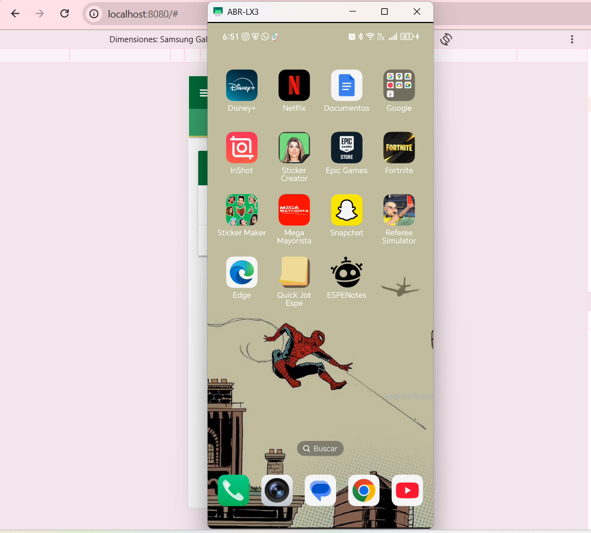
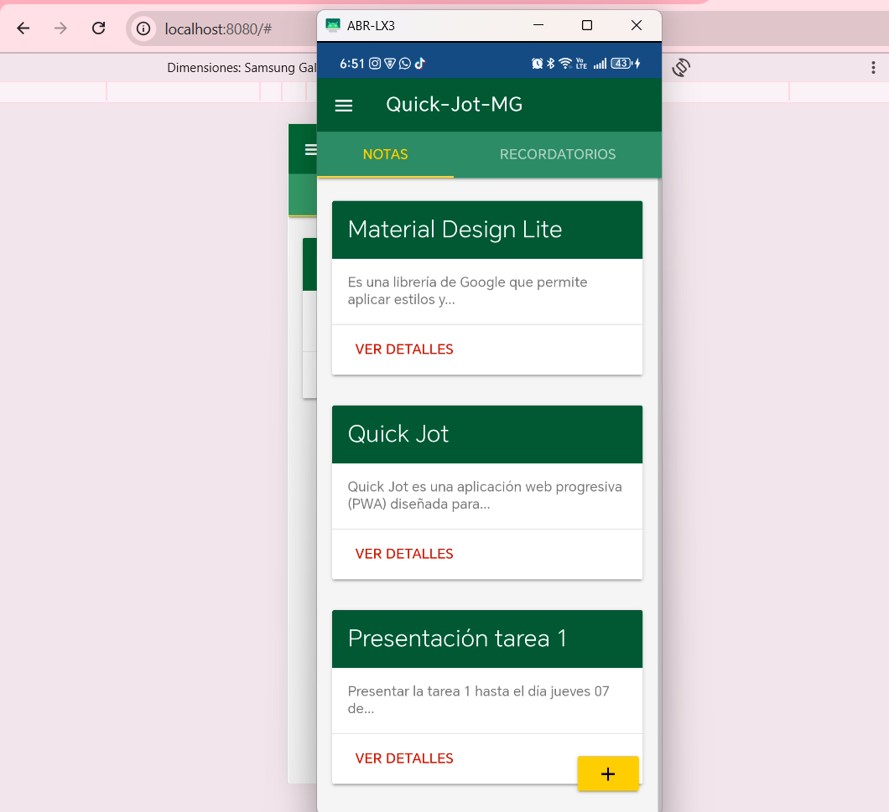

# Quick Jot MG - PWA

Quick Jot MG es una **aplicación web progresiva (PWA)** diseñada para tomar y gestionar notas de forma rápida y sencilla, con la capacidad de instalarse en dispositivos móviles y funcionar incluso sin conexión a internet.

## Características principales

- **Crear notas** con título y descripción.
- **Visualizar notas** en forma de tarjetas con un resumen.
- **Ver detalles** de una nota en un modal.
- **Guardado automático** en `localStorage` para persistencia local.
- **Diseño responsive** adaptable a móviles y escritorio.
- **PWA instalable** gracias a `manifest.webmanifest` y `Service Worker`.

## Demostracion en PC

| Vista principal | Modal de nueva nota | Detalles de nota |
|-----------------|--------------------|------------------|
|  |  |  |

## Demostracion en Movil

| Vista mediante GithubPages | Instalacion de aplicacion| Aplicacion Instalada | Visualizacion en aplicacion instalada |
|-----------------|--------------------|------------------|------------------|
|  |  |  | |

## Instalación y ejecución en desarrollo

```bash
# Clonar el repositorio
git clone https://github.com/MathiasGR27/Quick-jot-MG.git

# Entrar al directorio
cd Quick-jot-MG

# Instalar dependencias (si aplica)
npm install

# Iniciar servidor de desarrollo
npm run start
```
Luego abre en tu navegador:  
```
http://localhost:8080
```

## Instalación en el celular

Gracias a la configuración del **Service Worker**, es posible instalar esta PWA en el celular como si fuera una aplicación nativa.  
En el archivo principal del proyecto se incluyó este fragmento de código:

```javascript
if (navigator.serviceWorker) {
    const basePath = location.hostname === "localhost" ? "" : "/Quick-jot-MG";
    try {
      const res = await navigator.serviceWorker.register(`${basePath}/sw.js`);
      if (res) {
        console.log("Service Worker registered successfully.");
      }
    } catch (error) {
      console.error("Service Worker registration failed:", error);
    }
}
```

Este bloque detecta si el navegador soporta **Service Workers** y registra el archivo `sw.js`.  
La variable `basePath` permite que el registro funcione tanto en desarrollo (`localhost`) como en producción (GitHub Pages en `/Quick-jot-MG`).  
El Service Worker se encarga de **cachear los recursos** para que la aplicación pueda ejecutarse offline y ser instalable en el celular.

## Estructura del proyecto
```
Quick-jot-MG/
├── src/
│   ├── css/
│   │   └── app.css
│   ├── images/
│   │   └── docs
│   │   └── icons
│   ├── js/
│   │   └── app.js
├── index.html
├── manifest.json
├── sw.js
└── README.md
```

## Despliegue en GitHub Pages

Para desplegar esta PWA en GitHub Pages:
1. Sube el proyecto a un repositorio en GitHub.
2. Activa GitHub Pages en la rama `main`.
3. Ajusta la ruta base (`basePath`) para que apunte a `/Quick-jot-MG` o al nombre de tu Repositorio.

## Configuración del Manifest

```json
{
  "lang": "es",
  "short_name": "Quick Jot Espe",
  "name": "Quick Jot Espe MG",
  "description": "Aplicacion que permite tomar notas de forma sencilla y rapida",
  "background_color": "#1a4d80",
  "theme_color": "#1a4d80",
  "orientation": "portrait",
  "display": "standalone",
  "start_url": "./",
  "scope": "./",
  "icons": [
    { "src": "src/images/icons/144x144.png", "sizes": "144x144", "type": "image/png" },
    { "src": "src/images/icons/192x192.png", "sizes": "192x192" },
    { "src": "src/images/icons/256x256.png", "sizes": "256x256" },
    { "src": "src/images/icons/384x384.png", "sizes": "384x384" },
    { "src": "src/images/icons/512x512.png", "sizes": "512x512" }
  ]
}
```

## Configuración del Sw.js
El archivo sw.js (Service Worker) es un script que el navegador ejecuta en segundo plano, separado del hilo principal de la página web.
Esto permite manejar cosas como caché offline, sincronización en segundo plano y notificaciones push.

1. Instala el Service Worker y salta la espera.
2. Reclama el control de las páginas abiertas al activarse.
3. Tiene listeners para fetch, sync y push, pero sin lógica implementada aún.
